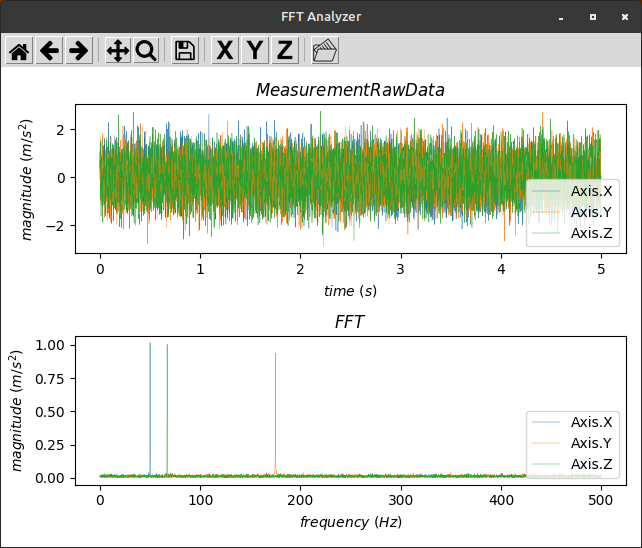
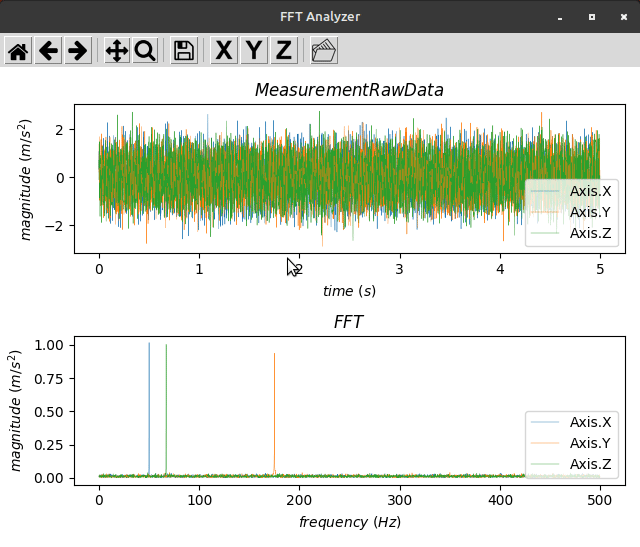
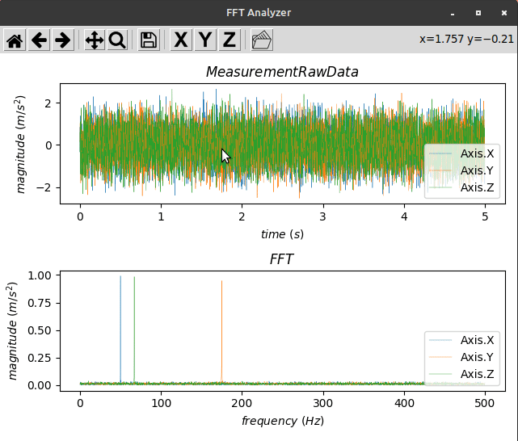

# FFT Analyzer
Simple desktop application that will take csv data from 3 axis vibration measurement and plot fft. User can select area of interest within data for fft calculation. This app used matplotlib, tkinter and scipy.

## How To Run Application on Linux
1. Download fft-analyzer-x.y.z from release page and copy it to any directory you want
2. Enter following command on your terminal to add execution permission to the file (make sure you are in the same directory as the executable)
```bash
chmod +x fft-analyzer-x.y.z
./fft-analyzer-x.y.z
```
3. You should get a new window with default view and dataset as follows
 



## How To Run Application on Any Machine
1. Make sure you have python 3.8 or later installed
2. Install all dependencies using pip by entering following command
```bash
pip3 install -r requirements.txt
```
3. Run app.py
```bash
python3 app.py
```

## Features
### Toggling plot Visibility

### Calculate FFT From Area of Interest

### Importing CSV Data

